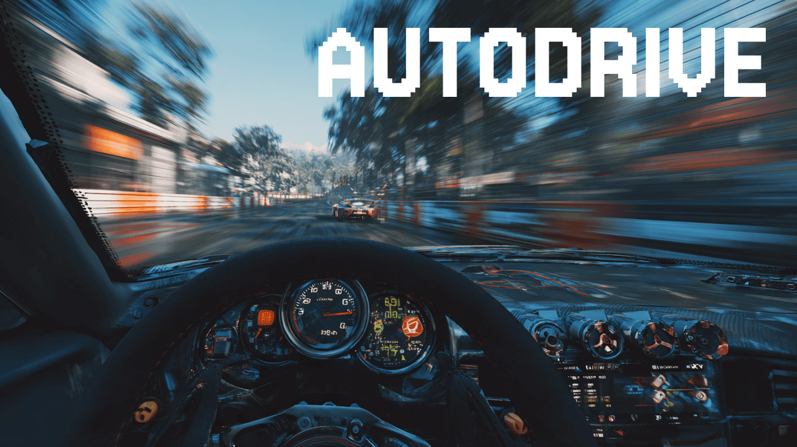

# AutoDrive



A 2D driving game with a **trainable autopilot** powered by neural networks. Create custom tracks, collect driving data, and train your own AI driver. Built with React, TypeScript, Phaser 3, PyTorch, and Express.

## Features

- **Trainable Autopilot**: GRU-based neural network learns to drive from your telemetry data
- **Playable Game**: Drive a car around custom tracks with arcade-style physics
- **Track Builder**: Visual canvas-based editor for creating custom racing tracks
- **AI Texture Generation**: Generate photorealistic track textures using Runware FLUX with ControlNet guidance
- **Distance Sensors**: Three radar rays detect obstacles and track boundaries
- **Telemetry Collection**: Record gameplay data (inputs, sensor readings) for training the autopilot
- **Timer**: Track your lap times and performance

## Quick Start

### Prerequisites
- Node.js (see `.node-version` for required version)
- npm

### Installation
```bash
npm install
```

### Running the Application
```bash
npm run dev:all
```

This starts both:
- Frontend on http://localhost:5173
- Backend API on http://localhost:3001

### Individual Services
```bash
npm run dev          # Frontend only
npm run dev:server   # Backend only
```

## Usage

### Playing the Game
1. Navigate to the Game page
2. Use **WASD** keys to control the car:
   - W: Accelerate
   - S: Brake/Reverse
   - A: Turn left (when moving)
   - D: Turn right (when moving)
3. Stay between the track boundaries
4. Switch tracks using the overlay menu
5. **Press T** to save telemetry data during successful runs (avoid crashes for better training data)

### Building Tracks
1. Navigate to the Track Builder page
2. Click to place points for the outer boundary
3. Complete the outer boundary, then draw the inner boundary
4. Click to set the starting position
5. (Optional) Click "Generate Texture" to create a photorealistic track surface using AI
6. Save your track with a unique name

**Texture Generation Setup** (Optional):
- Requires `RUNWARE_API_KEY` environment variable
- Get your API key from https://runware.ai
- Add to `.env` file: `RUNWARE_API_KEY=your_key_here`
- Uses FLUX model with ControlNet for structure-guided generation
- Generates photorealistic racing circuit textures that respect track boundaries
- ControlNet guide is generated locally from track borders (no external preprocessing)

## Training Your Own Autopilot Model

The project includes a GRU-based neural network that can learn to drive from telemetry data.

### Collecting Training Data

1. **Record Telemetry**: Play the game and collect telemetry data from successful driving
   - **Press T** to save telemetry during your runs (avoid crashes for cleaner training data)
   - Aim for **15+ minutes** of driving data (total across all sessions)
   - Use a **wide variety of tracks** to help the model generalize

2. **Data Location**: Telemetry files are automatically saved to `server/telemetry/`

### Training the Model

```bash
cd autopilot
uv run python src/autopilot/train.py
```

The training script will:
- Load all telemetry data from `server/telemetry/`
- Train a GRU-based neural network on driving sequences
- Save the best model to `autopilot/models/best_model.pt`
- Display training progress and validation metrics

Optional parameters:
- `--epochs N` - Number of training epochs (default: 50)
- `--batch-size N` - Batch size (default: 32)
- `--wandb` - Enable Weights & Biases logging
- `--help` - See all available options

## Tech Stack

- **Frontend**: React 19, TypeScript 5.9, Phaser 3.90, Vite 7.1
- **Styling**: Tailwind CSS 4.1
- **Routing**: react-router-dom 7.9
- **Backend**: Express 4.18
- **Game Engine**: Phaser 3 (canvas-based 2D rendering)
- **ML**: PyTorch (GRU-based autopilot)

## Project Structure

```
autodrive/
├── src/                    # Frontend source
│   ├── components/         # React components
│   ├── scenes/            # Phaser game scenes
│   ├── systems/           # Game systems (physics, radar, telemetry)
│   ├── utils/             # Utilities (collision, interpolation)
│   └── types/             # TypeScript type definitions
├── server/                # Backend Express API
│   ├── tracks/            # Saved track JSON files
│   └── telemetry/         # Saved telemetry data
└── public/                # Static assets
```

## Development

### Build for Production
```bash
npm run build
npm run preview
```

### Linting
```bash
npm run lint
```

## Data Files

- **Tracks**: Stored as JSON in `server/tracks/`
- **Telemetry**: Stored as JSON in `server/telemetry/`

Each track includes boundary points, starting position, and interpolated curves for smooth rendering.

## License

[Add license information]
